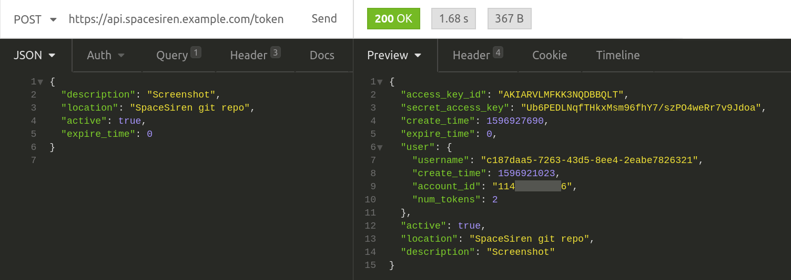

# SpaceSiren

SpaceSiren is a [honey token](https://en.wikipedia.org/wiki/Honeypot_(computing)) 
manager and alert system for AWS. With this fully serverless application,
you can create and manage honey tokens at scale -- up to 10,000 per SpaceSiren
instance -- at close to no cost.1

## How it works

* It provides an an API Gateway to create no-permission AWS IAM users and access keys for those users.
* You sprinkle the access keys wherever you like, for example in proprietary code or private data stores.
* If one of those sources gets breached, an attacker is likely to use the stolen key to see what they can do with it.
* You will receive an alert via email, PagerDuty, etc. that someone attempted to use the key.

It's powered by Terraform, Lambda, Python 3, API Gateway, and DynamoDB.

While the product itself is free and open source, you'll of course incur some AWS operating costs. However, it's designed to be run as cheaply as possible. Being completely serverless, you shouldn't be spending more than $1-$5 per month.

Supported alert outputs include:

* Email
* PagerDuty
* Slack
* Pushover

> 

## Documentation Pages

* [Getting Started](docs/getting-started.md)
* [Alerts](docs/alerts.md)
* [API Documentation](docs/api.md)
* [Terraform Variables](docs/tfvars.md)

## Requirements

As with any open source project, this one assumes you have the required
foundational tools and knowledge, mainly in AWS and Terraform.

### Resources

* Terraform >= 0.13
* AWS CLI
* A dedicated AWS account with admin access
* A registered domain

### Knowledge

* Basic Terraform
* Basic REST API
* Basic AWS CLI, S3, and Route 53
* Basic AWS Organizations and IAM Roles for cross-account access
* Intermediate DNS (delegating a (sub)domain with NS records)

## Contact

If you notice a critical security bug (e.g., one that would grant real access to
an AWS account), please responsibly disclose it via email at
[contact@spacesiren.io](mailto:contact@spacesiren.io).

For standard bugs or feature requests, please open a GitHub issue.

## Attributions

Special thanks to:

* Atlassian for [Project SpaceCrab](https://bitbucket.org/asecurityteam/spacecrab), the
  inspiration for this project. If you want to read about why I started SpaceSiren,
  please see my [SpaceCrab critique](docs/spacecrab.md) page.
* The wonderful and talented
  [Alia Mancisidor](https://www.instagram.com/aliamancisidor/) for the artwork.
* Anyone who volunteered to test this application for me.

---

## Footnotes

1. While SpaceSiren was designed to run as cheaply as possible, even for
   individuals, it will not be entirely free of operating costs. You will incur
   nominal costs for DynamoDB, Lambda, API Gateway, Route 53, and perhaps
   CloudTrail, depending on your configuration. You should expect to spend
   between $1 and $5 per month to run SpaceSiren. Of course, the project's
   maintainers are not responsible for any actual costs you incur. Please closely
   monitor your AWS bill while it is in use. 
