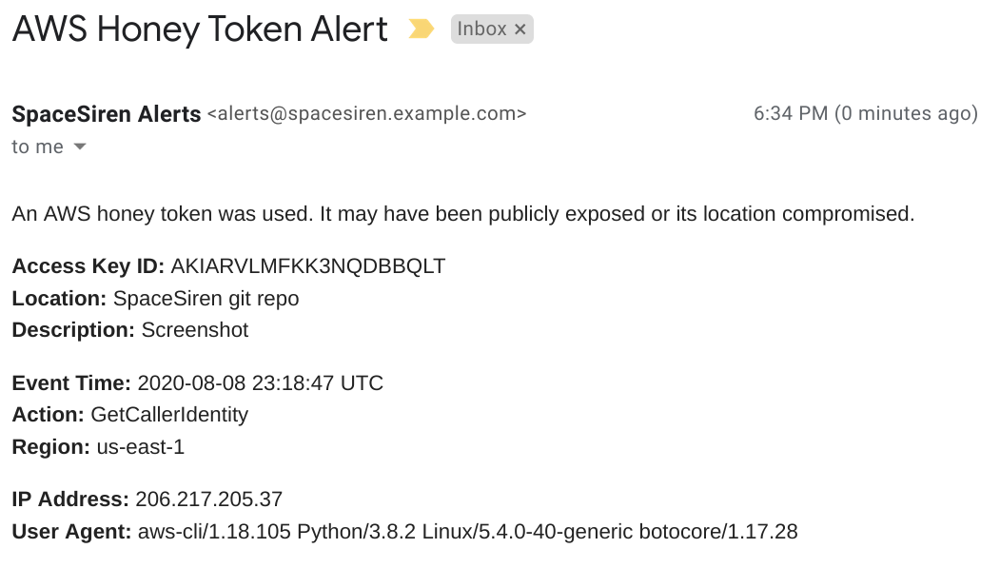

# Email Alerts

← [Home](../../README.md) / [Alerts](../alerts.md)

> 

Email alerts will be sent to your inbox or distribution list. Options include:

* `alert_email_to_address` (required): The destination of alert messages.
* `alert_email_from_user` (required): The username of the FROM email address.
  The domain will match the one you configured in `dns_zone_name`. For example,
  set this value to "**alerts**", and the email will come from
  "**alerts@spacesiren.example.com**".
* `alert_email_from_display` (optional): The display name of the FROM email
  address. Defaults to "SpaceSiren Alerts".
  
For example, your `terraform.tfvars` file may look like this for email alerts.

```
alert_email_from_user    = "alerts"
alert_email_from_display = "MyCompany SpaceSiren Alerts
alert_email_to_address   = "security@example.com"
```
  
Re-run Terraform to apply your changes:

```
$ terraform init
$ terraform apply
```
  
## Verification

By default, you will need to verify the email address you wish to send alerts
to. You should automatically receive a verification email after running Terraform
apply. If your AWS account is enabled for production SES, you may disable
verification of the TO email address by setting:

```
alert_email_verify_to_address = false
```
