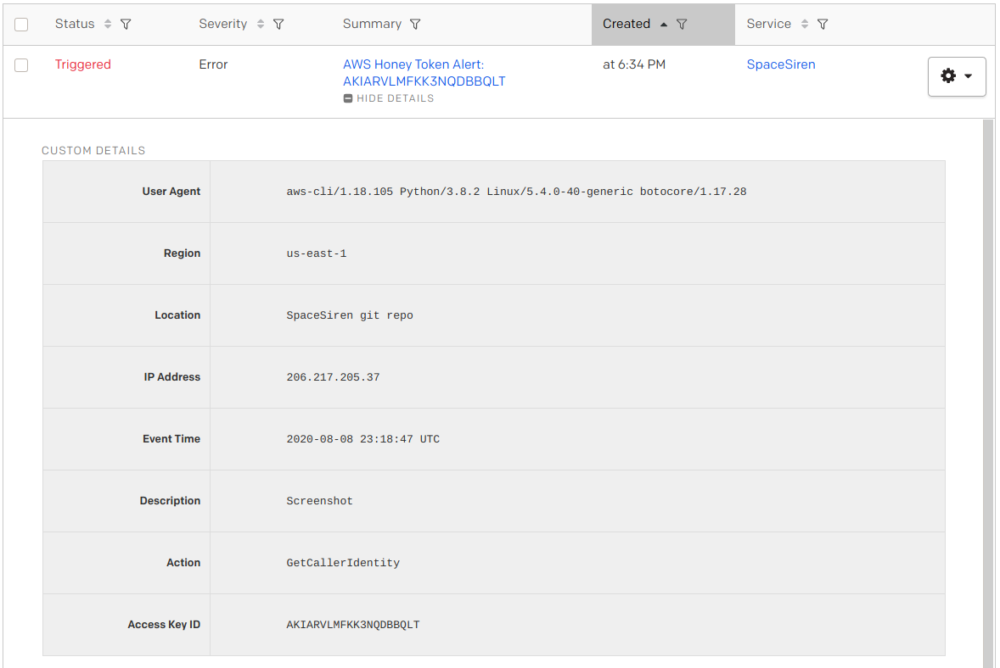

# PagerDuty Alerts

← [Home](../../README.md) / [Alerts](../alerts.md)

> 

Alerts can also be sent to PagerDuty to notify your on-call personnel.

You will need to have a PagerDuty account and set up a new service integration
of type "**Events API v2**". Once you have the integration key, you may configure
the variable in your `terraform.tfvars` file, like so:

```
alert_pagerduty_integration_key = "0123456789abcdef0123456789abcdef"
```

Re-run Terraform to apply your changes:

```
$ terraform init
$ terraform apply
```
